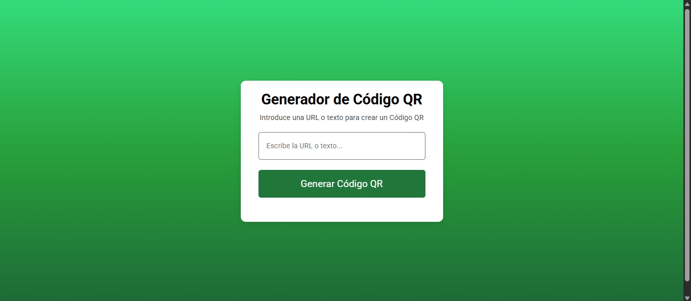

# QR Code Generator

A modern, accessible, and fully responsive frontend project that allows users to generate dynamic QR codes from any text or link. Built entirely from scratch using pure HTML, CSS, and JavaScript, without any frameworks.

---

## Key Features

- Real-time QR code generation using an external API
- Minimalist, responsive, and clean user interface
- Smooth feedback and status messages
- Accessibility support for screen readers (aria-*, sr-only)
- Ability to download the generated QR code as an image

---

## Project Structure

Projeto.QRcode/
├── index.html
├── css/
│ └── styles.css
├── js/
│ └── scripts.js
├── img/
│ ├── qrcode.png
│ └── preview.jpg

---

## Technologies Used

- HTML5 – semantic structure
- CSS3 – responsive layout with media queries
- JavaScript ES6 – DOM manipulation, dynamic interaction, download logic
- External API – for QR code generation

  ---

  ## Live Preview

  

 ---

 ## Technical Details

 ### Accessibility
 - Uses aria-live for dynamic status updates
 - Accessible button with aria-label and title
 - sr-only elements included for screen readers

 ### Interactivity
 - Reusable function for QR generation and reset
- Button state changes ("Generating..." → "Create New QR")
- Pulse animation feedback when downloading

 ### Advanced Functionality
 - Converts  the QR code into a downloadable image using canvas
 - Implements crossOrigin to render external images without errors
 - Supports both click and “Enter” key for user interaction

---

## License 

- This project was developed for educational and portfolio purposes only.
- You are free to use and adapt it, but commercial or deceptive usage is prohibited.

---

## Author

Amanda Cereja 
GitHub: @amandaceereja
Contact: amandacereja027@outlook.com